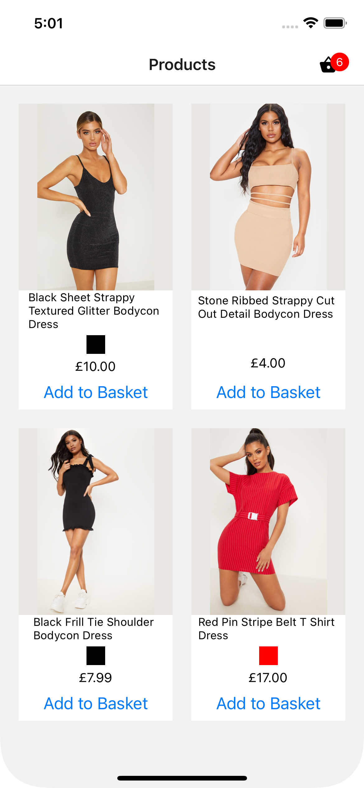

# test-PLT 

This repository contains a basic eCommerce mobile app built with React Native and Expo. The objective of this app is to integrate product and menu data from a JSON database.

  
  

## Demo Link

You can view the Expo Go demo by clicking [here](https://expo.dev/@liamg/test-PLT?serviceType=classic&distribution=expo-go).

## Tests
Tests can be run using `npx jest`.

## Requirements

The app should fulfill the following shopping requirements:

- View a list of products with their price and information.
- Add products to a basket.
- Navigate to a basket screen.
- Edit the quantity or remove items from the basket screen.

